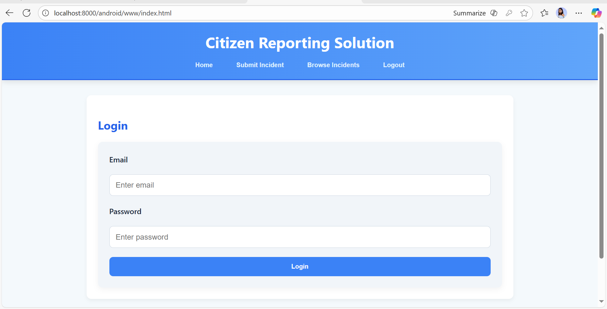
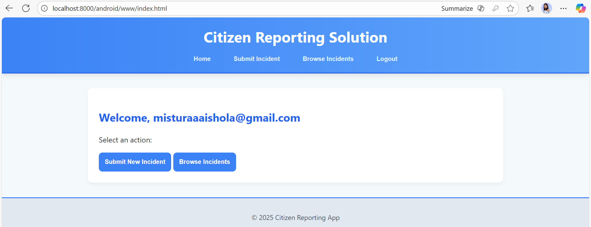
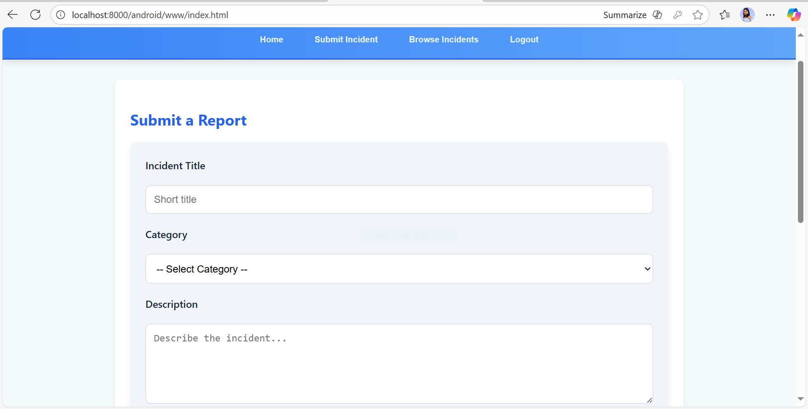
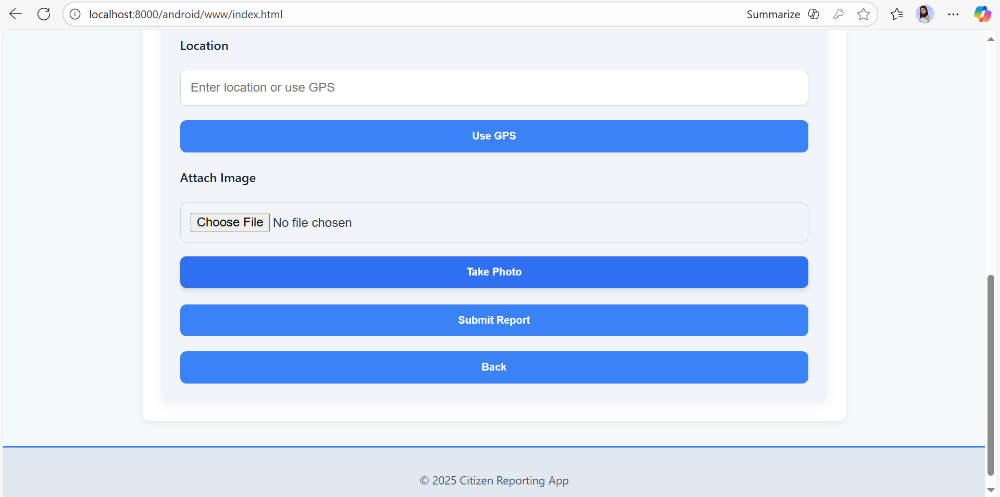
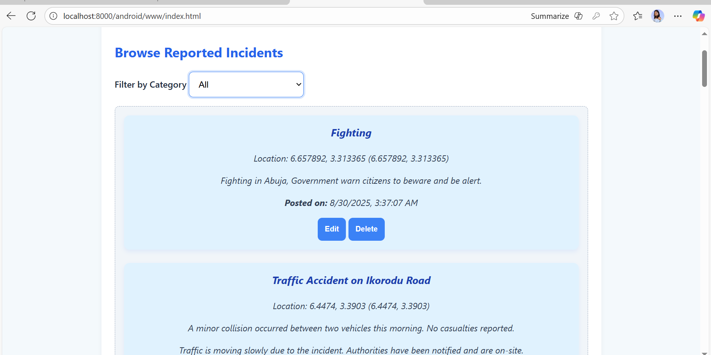
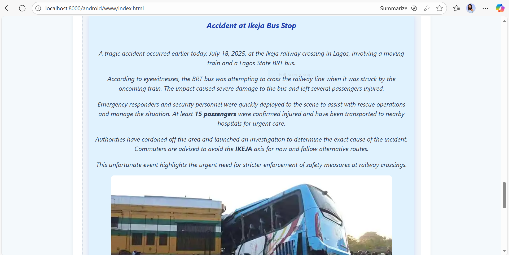

# Citizens Reporting App (Cordova)

**Description:**  
This is the final project for the **Mobile App Development class at Bincom Academy**, built using **Cordova and App.js**.  
The app demonstrates essential mobile development skills, including **geolocation**, **image handling**,
**real-time notifications** via **Firebase** and integration with a **WordPress backend**.  

 
---

## **Features**  
- Mobile app built with **Cordova + App.js**  
- Incident reporting with **geolocation**  
- Upload images for incidents  
- Push notifications using **Firebase**  
- Backend integration with **WordPress REST API**  
- Secure login (developer-only for testing purposes)  
- Clean and well-structured code  

---

## **Tech Stack**  
- **Frontend**: HTML, CSS, JavaScript  
- **Mobile App Framework**: **Cordova + App.js**  
- **Backend**: **WordPress (REST API)**  
- **Notifications**: **Firebase**  

---

## **App Previews**

### Home Page

### Welcome Page

### Submit Incident Page - Step 1

### Submit Incident Page - Step 2

### Incident Details Page - 1

### Incident Details Page - 2

---

## **APK**  
- Test the app on Android: [Download APK](https://drive.google.com/file/d/1PUdq0uhGcnzKGBVheRO65IdvYQQEtmdp/view?usp=sharing)

> **Note**: This version has **restricted login** (only the developer can log in for testing purposes).

---

## **Developer**
Developed by: **Mistura Ishola**

Connect with me:[LinkedIn](https://www.linkedin.com/in/mistura-ishola)
